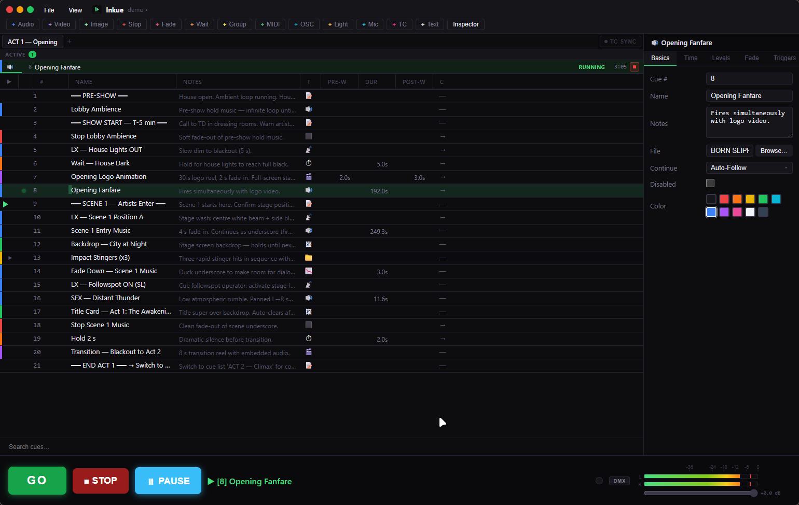

<div align="center">

# Inkue

**A professional, cross-platform show-control application.**

Cue lists for live events — theatre, concerts, corporate shows — with a focus on
reliability, low latency, and an extensible cue architecture.
Runs on **Windows, macOS and Linux**.

[](LICENSE)
[](#download)
[](https://tauri.app/)
[](https://github.com/FonograF/Inkue/actions/workflows/ci.yml)
[](https://github.com/sponsors/FonograF)

<br>



</div>

---

## Download

Grab the latest installer for your platform from the **[Releases page](https://github.com/FonograF/Inkue/releases/latest)**:

| Platform | File | Notes |
|---|---|---|
| **Windows 10 / 11** | `Inkue_x.y.z_x64-setup.exe` or `.msi` | libmpv is bundled — nothing else to install |
| **macOS** (Apple Silicon + Intel) | `Inkue_x.y.z_universal.dmg` | requires `libmpv` (`brew install mpv`) |
| **Linux** (x86-64) | `.deb` / `.AppImage` | `.deb` pulls in `libmpv` automatically |

> Inkue is young software. If something breaks during a show-critical moment,
> please [open an issue](https://github.com/FonograF/Inkue/issues) with the log
> (File → Logs… → Open folder).

---

## What is Inkue?

Inkue drives the playback side of a live show from a single ordered **cue list**.
The operator presses **GO**; Inkue fires the cue at the **playhead** — play a
sound, roll a video, fade a light, send an OSC/MIDI message — and advances.
Its vocabulary, keyboard flow and behaviour follow established show-control
conventions, so experienced operators feel at home immediately.

It is built with **Rust** (real-time audio/video engine + show logic) and
**React + TypeScript** (UI) via [Tauri v2](https://tauri.app/), which keeps the
binary small and the audio path native and low-latency.

---

## Features

### Cue types

| Type | Description |
|---|---|
| **Audio** | WAV, MP3, FLAC, OGG, AAC, M4A — sample-accurate WASAPI/ASIO/CoreAudio/ALSA playback with fade-in/out, trim, loop (finite + infinite), rate and pan |
| **Video** | Fullscreen or floating output window via libmpv (unified GL Render API); audio decoded as a normal audio voice (VU metering, fades); loop |
| **Image** | Any image format via libmpv; dip-to-black fades; optional display duration; stops on next visual GO |
| **Group** | Sequential or Simultaneous; sequential mode holds the outer playhead and absorbs GO presses to advance the internal sequence |
| **Wait** | Fixed-duration delay; integrates with Auto-Continue chains |
| **Stop** | Stops all running cues or a chosen subset (soft fade or hard cut) |
| **Fade** | Fades volume (dB) and/or image brightness on any running cue(s) to a target; configurable curve; optional Stop at End |
| **OSC** | Sends one or more UDP OSC messages on GO; multiple messages per cue; workspace-level named patches |
| **MIDI** | Sends Note On/Off, Control Change, Program Change on GO; dynamic port enumeration (WinMM/CoreMIDI/ALSA) |
| **Light** | DMX-over-IP (sACN E1.31 + Art-Net); fixture patch in the workspace; fades fixture parameters to a target look (tracking + LTP) |
| **Mic** | Routes a live audio input through the engine (separate in/out devices, adaptive drift resampler, gain/pan/fade/VU) |
| **Timecode** | SMPTE timecode generate + receive (MTC); LTC encode/decode; per-cue TC triggers + cue-list sync |
| **Text** | Renders styled text on the output surface (font, size, colour, 9-point grid); independent of the OSD timer |
| **Memo** | Read-only label; no playback action |

### Transport & playback

- **GO / STOP / Hard Stop** — keyboard (Space / Escape / double-Escape), toolbar, or OSC remote
- **Pre-Wait / Post-Wait**, **Auto-Continue** (overlap) and **Auto-Follow** (chain on finish)
- **Pause / Resume** and **scrub / seek** — individual cues or everything at once; counters freeze at the exact pause position
- **Double-GO protection** — configurable debounce (default 500 ms) drops duplicate triggers
- **Show Mode** (F5) — a read-only, large-type operator view

### Output & I/O

- **Unified output window** — a single persistent native window (mpv OpenGL Render API) for all video and image cues; no flicker between cues; fullscreen on any monitor or a draggable floating window
- **Output timer** — OSD overlay with the bundled DSEG7 7-segment font; configurable font/size/position; optional always-on-top floating timer
- **Low-latency audio** via [cpal](https://github.com/RustAudio/cpal) — WASAPI / **ASIO** on Windows, CoreAudio on macOS, ALSA / PipeWire on Linux

### Editing

Inspector with per-type tabs · waveform start/end trim · drag-and-drop reordering
and grouping · drop media from the file manager · toolbar-drag insert · multi-select
(edit/delete/duplicate/color) · full undo/redo · copy/paste · resizable/reorderable
columns · color tags · consistent dark theme on all three OSes.

### OSC remote control

Inkue listens on UDP **53001** (configurable). Examples:

| Address | Action |
|---|---|
| `/inkue/go` | Advance playhead and fire GO |
| `/inkue/stop` · `/inkue/hardstop` | Stop all (soft fade) / hard stop all |
| `/inkue/pause` · `/inkue/resume` · `/inkue/pause_toggle` | Pause / resume control |
| `/inkue/cue/{number}/go` · `/inkue/cue/{number}/select` | Jump to / select a specific cue |

A built-in **OSC Monitor** shows incoming packets in real time, and a 50 ms dedup
cache eliminates duplicate UDP packets from controllers and Windows loopback.

---

## Building from source

### Prerequisites

- [Rust](https://rustup.rs/) (stable) and [Node.js](https://nodejs.org/) + [pnpm](https://pnpm.io/)
- **libmpv** — required for video/image cues (~113 MB, not versioned in git):
  - Windows: place `libmpv-2.dll` in `src-tauri/vendor/mpv/` — get it from the baseline
    `mpv-dev-x86_64` build at [sourceforge.net/projects/mpv-player-windows](https://sourceforge.net/projects/mpv-player-windows/files/libmpv/)
    (the release CI pins the exact build)
  - macOS: `brew install mpv`
  - Linux: install the `libmpv2` (or `libmpv1`) + `libmpv-dev` system packages
- *(Optional, Windows)* The **Steinberg ASIO SDK** is already bundled in
  `vendor/asiosdk/` under its GPLv3 option (see [ASIO support](#asio-support)).

### Run & build

```bash
pnpm install
pnpm tauri dev            # development (WASAPI/CoreAudio/ALSA)
pnpm tauri:dev            # development, with ASIO support (Windows)

pnpm tauri build          # production installers
pnpm tauri:build          # production, with ASIO support (Windows)
```

Installers land in `src-tauri/target/release/bundle/`.

### Tests

```bash
cd src-tauri && cargo test     # cue registry, OSC, DMX, timecode, SR conversion, …
cargo clippy                   # zero warnings expected
```

### ASIO support

ASIO is **optional** and Windows-only, enabled by the `asio-support` Cargo feature
(`pnpm tauri:dev` / `pnpm tauri:build`). The Steinberg ASIO SDK is bundled in
`vendor/asiosdk/` under its **GPLv3 dual-license option**, which is compatible with
Inkue's own GPLv3 license, so no separate download or agreement is required to build
the open-source version. `CPAL_ASIO_DIR` is preconfigured in `src-tauri/.cargo/config.toml`.

> *ASIO is a trademark and software of Steinberg Media Technologies GmbH.*

---

## Architecture

```
src-tauri/src/
├── cue/       # Cue trait + CueRegistry + every cue type (audio, video, image, group,
│              #   wait, stop, fade, osc, midi, light, mic, timecode, text, memo)
├── engine/    # AudioEngine (cpal real-time thread), OutputEngine (libmpv GL Render API),
│              #   DMX engine/sink, OSC server/patch, device manager — know nothing about cues
├── show/      # transport (GO/STOP/PAUSE), cue list + playhead, event loop, workspace I/O, undo
├── commands/  # Tauri IPC handlers
└── state/     # AppState — engines, registry, undo, clipboard

src/
├── components/  # CueList, Inspector, Transport, ShowMode, Preferences, Lighting, Osc, …
├── stores/      # Zustand: workspace, transport, timing
├── hooks/       # useTauriEvents, useKeyboardShortcuts
└── lib/         # types.ts, commands.ts (typed Tauri invoke wrappers)
```

**Key invariants:**

- The audio callback has **zero allocations, zero locks, zero I/O** — all comms via lock-free ring buffers.
- Every cue type implements the `Cue` trait; adding a new type never touches `transport.rs`, `cue_list.rs` or the CueList UI.
- Three layers never mix: `engine/` (no cue knowledge) → `cue/` → `show/`.
- Every feature compiles and works on Windows, macOS **and** Linux.
- Machine-specific settings live in the per-OS config dir; show-specific settings travel in the `.inkue` file.

---

## Terminology

Inkue uses standard show-control vocabulary: **Workspace** (the `.inkue` file) ·
**Cue List** · **Playhead** (next GO target) · **GO** · **Pre-Wait / Post-Wait** ·
**Auto-Continue / Auto-Follow** · **Cue Number** (a string —
`"1"`, `"1.5"`, `"Intro"` are all valid).

---

## Contributing

Issues and pull requests are welcome. By contributing you agree that your
contributions are licensed under the GPL-3.0-or-later, the same license as the project.
Before a large change, please open an issue to discuss the design — the layering rules
above are strict on purpose.

---

## Support

Inkue is free and developed in the open. If it is useful to you, you can support
its development through **[GitHub Sponsors](https://github.com/sponsors/FonograF)**.
Thank you 💚

---

## License

Inkue is **free software**, licensed under the
**[GNU General Public License v3.0 or later](LICENSE)**.

Third-party components:

- **libmpv** — LGPL-2.1-or-later; loaded at runtime as an unmodified shared library ([mpv.io](https://mpv.io/)).
- **Steinberg ASIO SDK** — bundled under its GPLv3 dual-license option. *ASIO is a trademark and software of Steinberg Media Technologies GmbH.*
- **DSEG** 7-segment font — SIL Open Font License 1.1.
- Rust crates: cpal, symphonia, winit, glutin, glow, rosc, midir and others under their respective MIT/Apache-2.0/MPL-2.0 licenses.

Inkue is an independent project and is **not affiliated with or endorsed by** Steinberg.
